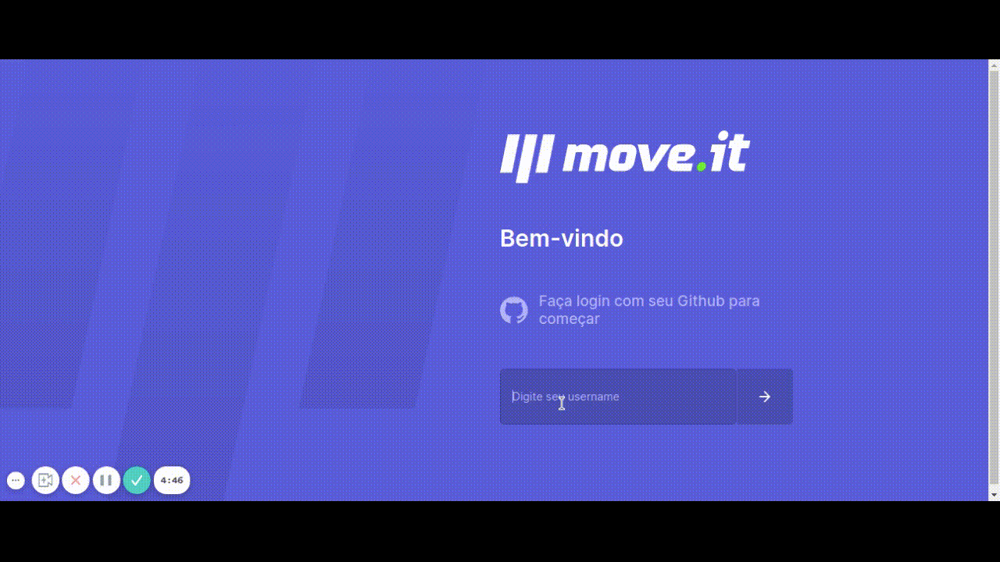
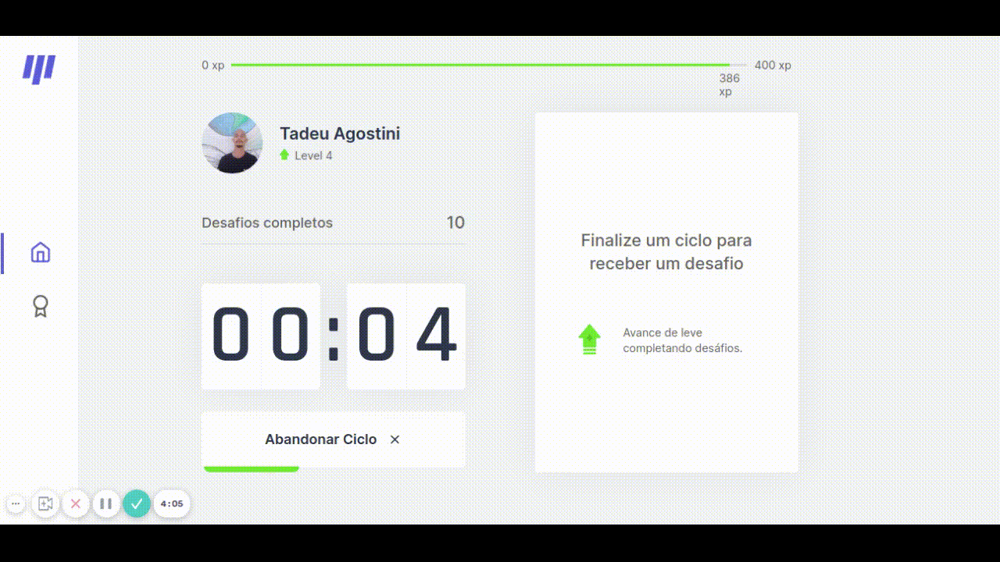

[![LinkedIn][linkedin-shield]][linkedin-url]

<!-- PROJECT LOGO -->
<br />
<p align="center">
  <a href="https://github.com/othneildrew/Best-README-Template">
    
  </a>

  <h3 align="center">Move.it</h3>

  <p align="center">
    Tenha foco e conquiste desafios
    <br />
    <br />
    <br />
    <strong>Request Feature</strong>
  </p>
</p>

<!-- TABLE OF CONTENTS -->
<details open="open">
  <summary>Indice</summary>
  <ol>
    <li>
      <a href="#about-the-project">Sobre o projeto</a>
      <ul>
        <li><a href="#built-with">Construido com</a></li>
      </ul>
    </li>
    <li>
      <a href="#getting-started">Getting Started</a>
      <ul>
        <li><a href="#prerequisites">Prerequisitos</a></li>
        <li><a href="#installation">Instalação</a></li>
      </ul>
    </li>
    <li><a href="#usage">Como usar</a></li>
    <li><a href="#roadmap">Roadmap</a></li>
    <li><a href="#contributing">Contribuição</a></li>
    <li><a href="#license">Licença</a></li>
    <li><a href="#contact">Contato</a></li>
    <li><a href="#acknowledgements">Reconhecimentos</a></li>
  </ol>
</details>

<!-- ABOUT THE PROJECT -->

## About The Project

[![Product Name Screen Shot][product-screenshot]](https://example.com)

Existem muitas aplicações de pomodoro pela internet, mas eles apenas cumprem a função de controlar o tempo e não trazem nenhuma interatividade que traga vontade de continuar a usa-los por muito tempo. Então a [Rocketseat](https://rocketseat.com.br/) criou a base desse projeto e eu segui aprimorando para levar ao próximo nível!

Here's why:

- Seu tempo deve ser focado em criar algo incrível. Um projeto que resolve um problema e ajuda os outros.
- Ao final de cada ciclo de trabalho duro, você deveria se recompensar, com atividades que beneficiem seu bem estar.
- Trabalhamos muito melhor, quando podemos competir e compartilhar nosso progresso com nossos amigos. :smile:

Obviamente, nenhum modelo atenderá a todos os projetos, pois suas necessidades podem ser diferentes. Portanto, estarei adicionando mais funcionalidades e atividades em um futuro próximo. Você também pode sugerir alterações bifurcando este repo e criando uma pull request ou abrindo um issue. Obrigado a todas as pessoas que contribuirão para expandir este modelo!

### Construido com

Esta secção lista todas as principais estruturas que usei para construir este projeto.

- [Next.js](https://nextjs.org/)
- [TypeScript](https://www.typescriptlang.org/)
- [React.js](https://pt-br.reactjs.org/)
- [styled-components](https://styled-components.com/)

<!-- GETTING STARTED -->

## Getting Started

Para rodar essa aplicação localmente você deve seguir esse passo a passo.

### Prerequisitos

Você deve ter instalado em sua maquina o `npm` ou `yarn` e `git`!

### Instalação

1. Clone esse repositório
   ```sh
   git clone https://github.com/TadeuA/NLW-4Web
   ```
2. Instale as dependências
   ```sh
   npm install
   ```
   ou
   ```sh
   yarn
   ```
3. Inicie a aplicação
   ```sh
   npm dev
   ```
   ou
   ```sh
   yarn dev
   ```

<!-- USAGE  -->

## Como usar

 
 

<!-- ROADMAP -->

## Roadmap

<ol>
    <li>
      <strong >Conectar com DB</strong>
    </li>
    <li>
      <strong>Grupos</strong>
    </li>
    <li><strong >Seguir amigos</strong></li>
    <li><strong >Alternativas de log in</strong></li>
    <li><strong >Novos desafios</strong></li>
    <li><strong >Recompensas<strong></li>
    <li><strong >Pedidos de usuários</strong></li>
  </ol>

<!-- CONTRIBUTING -->

## Contribuição

As contribuições são o que torna a comunidade de código aberto um lugar incrível para aprender, inspirar e criar. Quaisquer contribuições que você fizer serão **muito apreciadas**.

1. Bifurque( fork ) o projeto.
2. Crie sua Feature Branch (`git checkout -b feature/AmazingFeature`)
3. Commit suas mudanças (`git commit -m ':rocket:Add some AmazingFeature'`)
4. Suba(push) sua Branch (`git push origin feature/AmazingFeature`)
5. Abra uma Pull Request

<!-- LICENSE -->

## Licença

Distribuído sob a licença MIT. Veja `LICENÇA` para mais informações.

<!-- CONTACT -->

## Contato

Tadeu Agostini - [LinkedIn](https://www.linkedin.com/in/tadeuagostini) - tadeu01399@gmail.com

[license-url]: https://github.com/TadeuA/NLW-4Web/LICENSE.md
[linkedin-shield]: https://img.shields.io/badge/-LinkedIn-black.svg?style=for-the-badge&logo=linkedin&colorB=555
[linkedin-url]: https://linkedin.com/in/tadeuagostini
[product-screenshot]: .github/images/home.png
